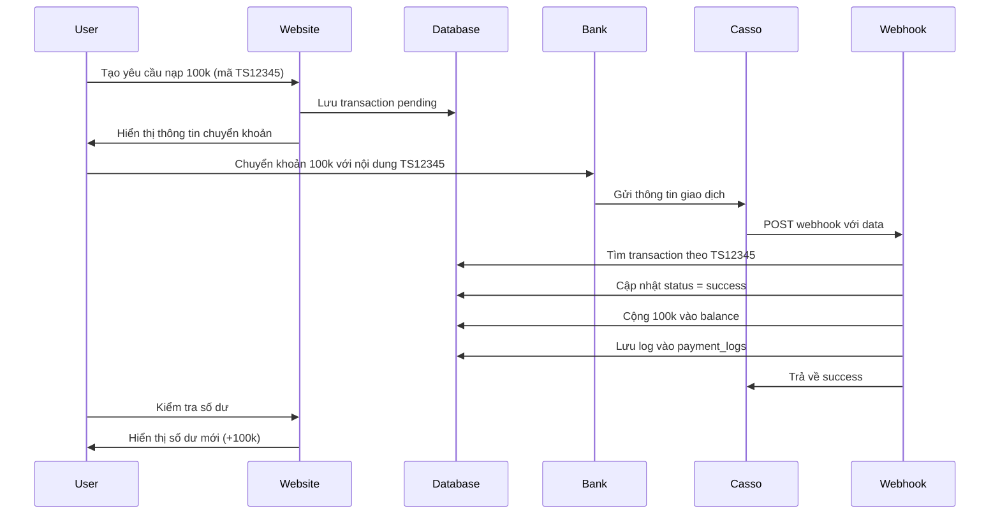

# 🚀 HƯỚNG DẪN TÍCH HỢP THANH TOÁN TỰ ĐỘNG

## 📋 Tổng quan

Hệ thống thanh toán tự động cho phép khách hàng nạp tiền và được cộng số dư tự động khi chuyển khoản ngân hàng, không cần admin xác nhận thủ công.

## 🎯 Tính năng

✅ Nhận webhook từ ngân hàng/dịch vụ thanh toán  
✅ Tự động đối chiếu mã giao dịch  
✅ Tự động cộng tiền vào tài khoản user  
✅ Log chi tiết mọi giao dịch  
✅ Bảo mật cao với IP whitelist và secret key  
✅ Hỗ trợ nhiều nguồn: Casso.vn, Payos.vn, API ngân hàng  
✅ Trang admin xem lịch sử và thống kê  

## 📁 Cấu trúc file

```
/workspace/
├── payment_config.php         # Cấu hình API và settings
├── payment_processor.php      # Class xử lý logic thanh toán
├── payment_webhook.php        # API endpoint nhận webhook
├── payment_logs.php          # Trang admin xem logs
├── payment_schema.sql        # SQL để cập nhật database
├── test_webhook.php          # File test webhook
├── db.php                    # Kết nối database
└── logs/                     # Thư mục chứa log files
    └── payment_webhook.log
```

## 🔧 Cài đặt

### Bước 1: Cập nhật Database

Chạy file SQL để tạo bảng mới:

```bash
mysql -u root -p vpn_vietnam < payment_schema.sql
```

Hoặc import vào phpMyAdmin.

**Các bảng sẽ được tạo:**
- `payment_logs` - Lưu log thanh toán tự động
- `notifications` - Thông báo cho user
- Thêm cột `updated_at` vào bảng `transactions`
- Thêm stored procedure tự động hủy giao dịch quá hạn

### Bước 2: Cấu hình API

Mở file `payment_config.php` và chỉnh sửa:

```php
// 1. Bật thanh toán tự động
define('PAYMENT_ENABLED', true);

// 2. Đổi secret key (quan trọng!)
define('WEBHOOK_SECRET', 'your-random-secret-key-here');

// 3. Cấu hình Casso.vn (nếu dùng Casso)
define('CASSO_ENABLED', true);
define('CASSO_API_KEY', 'YOUR_CASSO_API_KEY');
define('CASSO_SECURE_TOKEN', 'YOUR_CASSO_SECURE_TOKEN');

// 4. Cấu hình IP whitelist (tăng bảo mật)
define('ALLOWED_IPS', [
    '103.146.23.96',  // IP Casso.vn
    '127.0.0.1',      // Localhost để test
]);
```

### Bước 3: Tạo thư mục logs

```bash
mkdir logs
chmod 755 logs
```

### Bước 4: Đăng ký Webhook tại Casso.vn

1. Đăng ký tài khoản tại https://casso.vn
2. Liên kết tài khoản ngân hàng của bạn
3. Vào **Cài đặt** → **Webhook**
4. Thêm URL webhook:
   ```
   https://yourdomain.com/payment_webhook.php?source=casso
   ```
5. Nhập Secure Token (copy từ Casso)
6. Lưu và test webhook

## 🧪 Test hệ thống

### Test 1: Kiểm tra webhook hoạt động

```bash
curl "https://yourdomain.com/payment_webhook.php?test=1"
```

Kết quả mong đợi:
```json
{
    "success": true,
    "message": "Webhook is working",
    "server_time": "2025-11-30 10:30:00"
}
```

### Test 2: Giả lập giao dịch

1. Tạo giao dịch test trong database:

```sql
INSERT INTO transactions (user_id, amount_paid, transaction_date, status, unique_code) 
VALUES (1, 100000, NOW(), 'pending', 'TS12345');
```

2. Chạy file test:

```bash
php test_webhook.php
```

3. Kiểm tra:
   - Giao dịch chuyển sang `status = 'success'`
   - Số dư user tăng lên 100,000 VND
   - Có log trong bảng `payment_logs`

## 🔄 Luồng hoạt động



## 📊 Xem logs và thống kê

Truy cập: `https://yourdomain.com/payment_logs.php`

**Yêu cầu:** Phải đăng nhập với tài khoản admin (role = 'admin')

**Tính năng:**
- Xem tất cả log thanh toán
- Lọc theo ngày, trạng thái, nguồn
- Tìm kiếm theo mã giao dịch
- Xem thống kê tổng quan
- Xem raw data từ webhook

## 🔐 Bảo mật

### 1. IP Whitelist

Chỉ cho phép IP của Casso/Payos gọi webhook:

```php
define('ALLOWED_IPS', [
    '103.146.23.96',  // Casso IP 1
    '103.146.23.97',  // Casso IP 2
]);
```

### 2. Secret Key

Dùng secret key để xác thực request:

```php
// Trong webhook URL
https://yourdomain.com/payment_webhook.php?secret=YOUR_SECRET_KEY
```

### 3. Secure Token (Casso)

Casso gửi secure_token trong mỗi request, webhook sẽ validate.

### 4. Kiểm tra trùng lặp

Hệ thống tự động phát hiện và bỏ qua webhook trùng lặp.

## ⚙️ Cấu hình nâng cao

### Tự động hủy giao dịch quá hạn

Giao dịch pending quá 24h sẽ tự động chuyển sang `cancelled`.

**Kiểm tra event scheduler:**
```sql
SHOW VARIABLES LIKE 'event_scheduler';
```

**Bật event scheduler:**
```sql
SET GLOBAL event_scheduler = ON;
```

**Chạy thủ công:**
```sql
CALL cancel_expired_transactions();
```

### Thông báo cho user

Khi thanh toán thành công, có thể gửi thông báo qua:
- Email
- SMS
- Telegram
- Push notification

Chỉnh sửa hàm `notifyUser()` trong `payment_processor.php`.

## 🐛 Xử lý lỗi

### Lỗi: "Transaction not found"

**Nguyên nhân:** Không tìm thấy mã giao dịch trong nội dung chuyển khoản

**Giải pháp:**
- Kiểm tra user có ghi đúng mã không (ví dụ: TS12345)
- Kiểm tra regex trong hàm `extractUniqueCode()`

### Lỗi: "Amount mismatch"

**Nguyên nhân:** Số tiền chuyển khác với số tiền yêu cầu

**Giải pháp:**
- Cho phép sai số nhỏ (hiện tại: 1%)
- Liên hệ user xác nhận
- Xử lý thủ công trong admin

### Lỗi: "Access denied"

**Nguyên nhân:** IP không trong whitelist

**Giải pháp:**
- Thêm IP vào `ALLOWED_IPS` trong config
- Hoặc để trống `[]` để cho phép tất cả IP (không khuyến khích)

### Lỗi: "Already processed"

**Nguyên nhân:** Giao dịch đã được xử lý trước đó

**Giải pháp:**
- Đây là tính năng bảo vệ, không cần xử lý gì
- Webhook có thể gọi nhiều lần

## 📈 Monitoring và Maintenance

### Kiểm tra log định kỳ

```bash
tail -f logs/payment_webhook.log
```

### Xem thống kê

```sql
SELECT * FROM payment_statistics;
```

### Backup database

```bash
mysqldump -u root -p vpn_vietnam payment_logs > backup_payment_logs.sql
```

### Rotate log files

Log file tự động rotate khi đạt 10MB. File cũ sẽ được lưu với tên `payment_webhook.log.YYYYmmddHHiiss.old`.

## 🌐 Các dịch vụ hỗ trợ

### 1. Casso.vn ⭐ (Khuyến nghị)

**Ưu điểm:**
- Hỗ trợ 30+ ngân hàng Việt Nam
- Webhook realtime (< 5 giây)
- API đơn giản, dễ tích hợp
- Giá rẻ (từ 99k/tháng)

**Đăng ký:** https://casso.vn/

### 2. Payos.vn

**Ưu điểm:**
- Tích hợp QR code thanh toán
- Hỗ trợ nhiều phương thức thanh toán
- Dashboard quản lý đẹp

**Đăng ký:** https://payos.vn/

### 3. API Ngân hàng trực tiếp

**Yêu cầu:**
- Doanh nghiệp đã đăng ký
- Tài khoản ngân hàng doanh nghiệp
- Chi phí cao

## ❓ FAQ

**Q: Webhook có thể nhận được khi server đang bảo trì không?**  
A: Không. Cần đảm bảo server luôn online. Nếu webhook bị miss, có thể dùng API của Casso để sync lại lịch sử.

**Q: Có giới hạn số lượng webhook không?**  
A: Không. Nhưng nên optimize database để xử lý nhanh.

**Q: Nếu user chuyển nhầm số tiền thì sao?**  
A: Hệ thống sẽ reject nếu thiếu quá 1%. Nếu thừa tiền thì vẫn cộng đủ số tiền yêu cầu.

**Q: Có thể hoàn tiền tự động không?**  
A: Không. Hoàn tiền phải xử lý thủ công vì liên quan đến ngân hàng.

**Q: Webhook có bị DDoS không?**  
A: Có thể. Nên dùng Cloudflare hoặc firewall để bảo vệ.

## 📞 Hỗ trợ

- Email: admin@vpnvietnam.com
- Hotline: 0812.363.898
- Telegram: @vpnvietnam_support

## 📝 Changelog

### v1.0.0 - 2025-11-30
- ✅ Tích hợp Casso.vn
- ✅ Xử lý thanh toán tự động
- ✅ Admin dashboard xem logs
- ✅ Bảo mật IP whitelist + secret key
- ✅ Tự động hủy giao dịch quá hạn
- ✅ Log chi tiết mọi webhook

## 📄 License

© 2025 VPN Việt Nam. All rights reserved.
