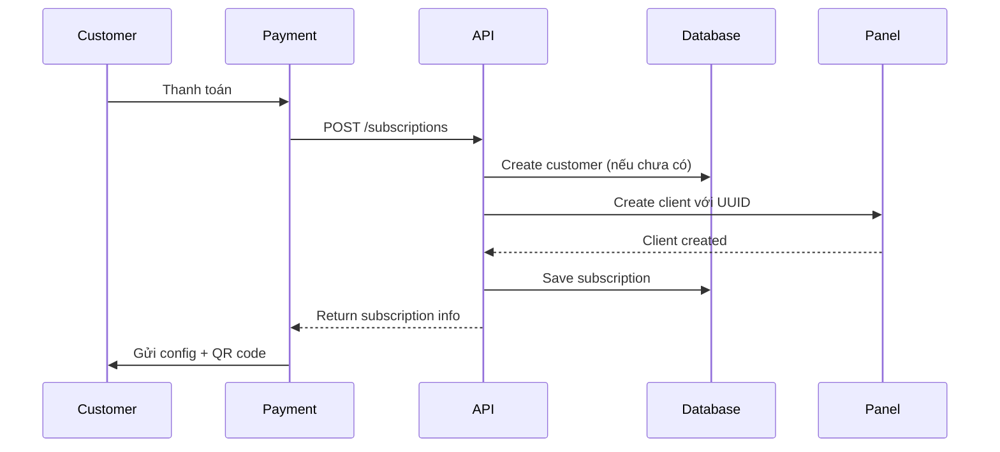

# Project Overview - VPN Subscription Management System

## 📌 Tóm tắt

Hệ thống này giải quyết vấn đề: **Tự động tạo cấu hình VPN trong x-ui hoặc 3x-ui khi khách hàng đăng ký dịch vụ**.

## 🎯 Vấn đề được giải quyết

**Trước đây:**
1. Khách hàng thanh toán
2. Admin phải vào panel thủ công
3. Tạo client mới
4. Copy thông tin cấu hình
5. Gửi cho khách hàng

**Bây giờ:**
1. Khách hàng thanh toán
2. Webhook/API tự động tạo subscription
3. Hệ thống tự động tạo client trong panel
4. Khách hàng nhận config ngay lập tức

## ⚡ Quick Start (3 bước)

### Bước 1: Setup
```bash
./scripts/setup.sh
```

### Bước 2: Cấu hình
```bash
nano .env
# Điền thông tin panel của bạn
```

### Bước 3: Chạy
```bash
python scripts/validate_setup.py  # Kiểm tra
python main.py                     # Chạy API
```

## 🏗️ Kiến trúc hệ thống

```
┌─────────────┐
│   Client    │ (Website, Telegram Bot, etc.)
│  (Payment)  │
└──────┬──────┘
       │ HTTP Request
       ↓
┌─────────────────────────────────┐
│   FastAPI Application           │
│  ┌──────────────────────────┐  │
│  │  API Endpoints           │  │
│  │  /subscriptions          │  │
│  │  /customers              │  │
│  │  /config                 │  │
│  └──────────┬───────────────┘  │
│             ↓                   │
│  ┌──────────────────────────┐  │
│  │  VPN Service             │  │
│  │  (Business Logic)        │  │
│  └──────┬──────────┬────────┘  │
│         ↓          ↓            │
│  ┌──────────┐ ┌──────────┐    │
│  │ X-UI     │ │ 3X-UI    │    │
│  │ Client   │ │ Client   │    │
│  └──────┬───┘ └────┬─────┘    │
└─────────┼──────────┼───────────┘
          ↓          ↓
   ┌──────────┐ ┌──────────┐
   │ X-UI     │ │ 3X-UI    │
   │ Panel    │ │ Panel    │
   └──────────┘ └──────────┘
```

## 📦 Component chi tiết

### 1. API Clients (`/clients`)

**xui_client.py** - Tương tác với x-ui panel
- Login và session management
- Create/Update/Delete clients
- Get traffic statistics
- List inbounds

**threexui_client.py** - Tương tác với 3x-ui panel
- Tương tự x-ui nhưng cho 3x-ui panel
- Support thêm các feature của 3x-ui

### 2. Service Layer (`/services`)

**vpn_service.py** - Business logic chính
- `create_customer()` - Tạo khách hàng
- `create_subscription()` - Tạo đăng ký (tự động tạo client trong panel)
- `get_subscription_config()` - Lấy cấu hình kết nối
- `renew_subscription()` - Gia hạn
- `update_subscription_status()` - Cập nhật trạng thái
- `sync_traffic_usage()` - Đồng bộ lưu lượng
- `delete_subscription()` - Xóa đăng ký

### 3. Database Models (`models.py`)

**Customer** - Thông tin khách hàng
- id, email, name, phone
- timestamps

**Subscription** - Thông tin đăng ký
- customer_id, panel_type, panel_inbound_id
- uuid, protocol
- traffic_limit_gb, traffic_used_gb
- expiry_date, status
- timestamps

**PanelConfig** - Cấu hình panel
- panel_type, url, credentials
- session tokens

### 4. API Endpoints (`main.py`)

| Method | Endpoint | Mô tả |
|--------|----------|-------|
| GET | `/` | API info |
| GET | `/health` | Health check |
| POST | `/customers` | Tạo khách hàng |
| POST | `/subscriptions` | **Tạo đăng ký mới** |
| GET | `/subscriptions/{id}` | Lấy thông tin |
| GET | `/subscriptions/{id}/config` | Lấy cấu hình |
| GET | `/subscriptions/{id}/qrcode` | Tạo QR code |
| PUT | `/subscriptions/{id}` | Cập nhật trạng thái |
| POST | `/subscriptions/{id}/renew` | Gia hạn |
| DELETE | `/subscriptions/{id}` | Xóa |
| POST | `/subscriptions/{id}/sync-traffic` | Đồng bộ traffic |

## 🔄 Workflow tạo đăng ký



## 💻 Ví dụ sử dụng

### Tạo đăng ký với curl

```bash
curl -X POST "http://localhost:8000/subscriptions" \
  -H "Content-Type: application/json" \
  -d '{
    "customer_email": "customer@example.com",
    "customer_name": "Nguyen Van A",
    "panel_type": "xui",
    "inbound_id": 1,
    "traffic_limit_gb": 100,
    "expiry_days": 30
  }'
```

### Tạo đăng ký với Python

```python
import httpx
import asyncio

async def create_subscription():
    async with httpx.AsyncClient() as client:
        response = await client.post(
            "http://localhost:8000/subscriptions",
            json={
                "customer_email": "customer@example.com",
                "customer_name": "Nguyen Van A",
                "panel_type": "xui",
                "inbound_id": 1,
                "traffic_limit_gb": 100,
                "expiry_days": 30
            }
        )
        return response.json()

subscription = asyncio.run(create_subscription())
print(f"Created: {subscription['id']}")
```

### Webhook integration

```python
# Trong payment gateway webhook
@app.post("/payment-webhook")
async def webhook(request: Request):
    data = await request.json()
    
    if data['status'] == 'paid':
        # Tự động tạo subscription
        async with httpx.AsyncClient() as client:
            await client.post(
                'http://localhost:8000/subscriptions',
                json={
                    'customer_email': data['email'],
                    'customer_name': data['name'],
                    'panel_type': 'xui',
                    'inbound_id': 1,
                    'traffic_limit_gb': data['plan_traffic'],
                    'expiry_days': data['plan_days']
                }
            )
```

## 📚 Documentation

| File | Mô tả |
|------|-------|
| `README.md` | Main documentation (Vietnamese) |
| `README_EN.md` | English documentation |
| `QUICKSTART.md` | Quick start guide |
| `API_GUIDE.md` | Detailed API documentation |
| `SUMMARY.md` | Project summary |
| `PROJECT_OVERVIEW.md` | This file - Architecture overview |

## 🔧 Scripts

| Script | Mô tả |
|--------|-------|
| `scripts/setup.sh` | Automatic setup |
| `scripts/validate_setup.py` | Validate configuration |
| `scripts/test_connection.py` | Test panel connections |
| `examples/create_subscription_example.py` | Example: Create subscription |
| `examples/webhook_example.py` | Example: Payment webhook |
| `examples/telegram_bot_example.py` | Example: Telegram bot |

## 🚀 Deployment Options

### Option 1: Direct Python

```bash
python main.py
```

### Option 2: Docker

```bash
docker-compose up -d
```

### Option 3: systemd Service

```bash
sudo systemctl enable vpn-api
sudo systemctl start vpn-api
```

### Option 4: Behind nginx

```nginx
server {
    listen 80;
    server_name api.domain.com;
    
    location / {
        proxy_pass http://127.0.0.1:8000;
        proxy_set_header Host $host;
    }
}
```

## 🔐 Security Checklist

- [ ] Change `API_SECRET_KEY` in `.env`
- [ ] Use HTTPS in production
- [ ] Add API authentication (JWT/API Key)
- [ ] Enable rate limiting
- [ ] Configure firewall
- [ ] Use strong panel passwords
- [ ] Regular backups
- [ ] Monitor logs

## 📊 Monitoring & Maintenance

### Health Check
```bash
curl http://localhost:8000/health
```

### View Logs
```bash
# systemd
sudo journalctl -u vpn-api -f

# Docker
docker-compose logs -f

# Direct
tail -f app.log
```

### Database Backup
```bash
cp vpn_service.db vpn_service_backup_$(date +%Y%m%d).db
```

## 🎓 Use Cases

### 1. VPN Service Provider
- Automatic account creation on payment
- Self-service portal
- Usage tracking

### 2. Corporate VPN
- Employee onboarding automation
- Department-based quotas
- Access revocation on termination

### 3. Educational
- Student account management
- Semester-based expiry
- Bulk operations

### 4. Reseller
- Multi-tier pricing
- White-label API
- Commission tracking

## 🧪 Testing

### Manual Testing
```bash
# Run validation
python scripts/validate_setup.py

# Test connection
python scripts/test_connection.py

# Create test subscription
python examples/create_subscription_example.py
```

### API Testing
Visit: http://localhost:8000/docs

### Load Testing
```bash
pip install locust
locust -f load_test.py
```

## 🔄 Typical Integration Flow

1. **Customer visits website** → Selects plan
2. **Payment gateway** → Processes payment
3. **Webhook fired** → POST to your webhook endpoint
4. **Your webhook** → POST to `/subscriptions` API
5. **API creates** → Client in panel + DB record
6. **Email sent** → Configuration to customer
7. **Customer connects** → Using provided config

## 📈 Scaling

### Horizontal Scaling
- Run multiple API instances behind load balancer
- Use shared database (PostgreSQL instead of SQLite)
- Redis for session management

### Vertical Scaling
- Increase server resources
- Optimize database queries
- Add caching layer

### Multi-Panel
- Configure multiple x-ui/3x-ui instances
- Load balance across panels
- Automatic failover

## 🛠️ Customization

### Add new panel type
1. Create client in `/clients`
2. Implement login, add_client, etc.
3. Update VPNService to support it
4. Add to schemas and config

### Add authentication
```python
from fastapi.security import HTTPBearer
security = HTTPBearer()

@app.post("/subscriptions")
async def create_subscription(
    credentials: HTTPAuthorizationCredentials = Depends(security)
):
    # Verify token
    ...
```

### Add notifications
```python
async def send_welcome_email(email, subscription_id):
    # Send email with config
    ...

async def send_expiry_warning(email, days_left):
    # Send warning
    ...
```

## 🐛 Common Issues

### "Cannot connect to panel"
→ Check panel URL, credentials, firewall

### "Inbound not found"
→ Verify inbound_id exists in panel

### "Database locked"
→ Close other connections or use PostgreSQL

### "Session expired"
→ API auto-refreshes, but check panel logs

## 📞 Getting Help

1. Check documentation files
2. Run validation script
3. Check API docs at `/docs`
4. Review examples in `/examples`
5. Enable debug logging

## ✅ Next Steps

1. **Setup**: Run `./scripts/setup.sh`
2. **Configure**: Edit `.env` file
3. **Validate**: Run `python scripts/validate_setup.py`
4. **Test**: Create test subscription
5. **Integrate**: Connect with your payment system
6. **Deploy**: Choose deployment method
7. **Monitor**: Set up logging and alerts
8. **Scale**: Add more panels as needed

## 🎉 Conclusion

Bạn đã có:
- ✅ Complete API for VPN management
- ✅ Integration with x-ui and 3x-ui
- ✅ Automatic subscription creation
- ✅ Examples for common integrations
- ✅ Production-ready deployment options
- ✅ Comprehensive documentation

**Start creating subscriptions automatically! 🚀**
